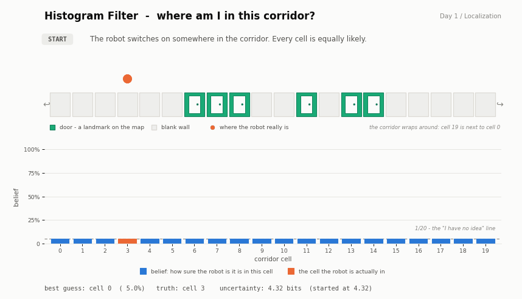
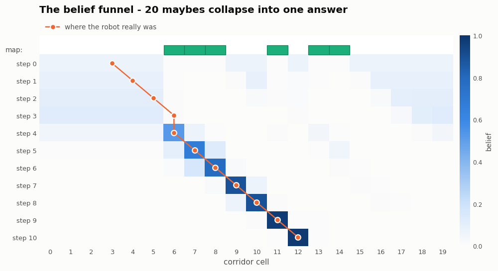

# Day 1 — The Histogram Filter (Discrete Bayes Filter)

> **The question:** a robot is switched on somewhere in a corridor and has no idea where.
> It can only tell "there is a door here" or "there is a blank wall here", and its wheels
> slip. Can it work out where it is?
>
> **The answer:** yes — and it takes about 15 lines of code.



---

## 1. The idea, with no maths at all

Imagine you wake up at 3 a.m. in a hotel corridor. You have the floor plan in your
pocket, but you don't know where on it you are standing. All you can see in the dark is
whether you are next to **a door** or **a blank wall**.

Here is what you would naturally do:

1. **Look.** You see a door. Now you know you are standing at *one of* the doors on the
   plan. You can't say which one yet — but you have ruled out every blank stretch.
2. **Walk one step.** Now you are next to *whatever comes after* each of those doors.
   Your list of candidates shifts along with you.
3. **Look again.** Another door. Only some of your candidates have a door in that spot,
   so the rest get crossed off.
4. **Repeat.** After a handful of steps, the pattern of doors and walls you have walked
   past matches exactly one place on the plan. You know where you are.

That is the whole algorithm. The robot does exactly this, with one extra piece of
honesty: it never fully crosses anything off, because **its eyes can lie and its feet
can slip**. Instead of a yes/no list of candidates, it keeps a *number* for every
possible location — "I'm 40% sure I'm here, 30% sure I'm there" — and nudges those
numbers up and down. That list of numbers is called the **belief**.

In the animation the belief is the bar chart at the bottom. Watch it start perfectly
flat (no idea at all) and end as a single tall spike (certain).

---

## 2. The two moves

Everything the filter ever does is one of two operations, alternating forever:

| | What happens | Effect on the belief | Everyday version |
|---|---|---|---|
| **SENSE** | fold in a sensor reading | **sharpens** it — information gained | "I see a door, so cross off the blank stretches" |
| **MOVE** | fold in a motion command | **blurs** it — information lost | "I took a step, but maybe it was a bit long or short" |

This is the tug-of-war at the heart of *all* robot localization. Moving makes you less
sure; looking makes you more sure. If you look often enough compared to how much you
move, you win. That single sentence is also why a Kalman filter and a particle filter
exist — they play exactly the same game, just with different bookkeeping.

### SENSE — multiply, then rescale

The robot's sensor is right 92% of the time. So when it reports "door":

- every cell that **has** a door on the map gets its number multiplied by **0.92**
- every cell that **doesn't** gets multiplied by **0.08**

Then all the numbers are rescaled so they add back up to 100%. That rescaling step is
the only reason this counts as "Bayes' rule" rather than just common sense — and Bayes'
rule really is just this: *multiply by how well each option explains what you saw, then
renormalise.*

Notice what the 0.08 buys you. A cell that disagrees with the sensor gets **squashed but
never killed**. So when the sensor lies — and in this run it does — the correct answer is
still alive, waiting to recover. A filter that used 0.0 there would confidently and
permanently convince itself of the wrong thing.

### MOVE — slide, then smear

The robot is told "drive one cell to the right". Its wheels obey 90% of the time;
5% of the time it goes one cell too far, 5% of the time it falls short.

So the filter takes the whole bar chart, **slides it one cell right**, and then
**smears each bar a little onto its neighbours**. Mathematically that is a convolution.
Visually it is exactly what it sounds like: the spike gets shorter and wider. The robot
just became a bit less sure of itself, which is correct, because it is.

---

## 3. Follow the arithmetic once

Tiny world, 5 cells, doors in cells 1 and 2:

```
cell:   0      1      2      3      4
map:   wall   DOOR   DOOR   wall   wall
```

**Start — no information.** Five cells, so 1/5 each:

```
0.200  0.200  0.200  0.200  0.200
```

**SENSE "door"** (right 90% of the time). Multiply each cell by 0.9 if it has a door,
0.1 if it doesn't:

```
0.020  0.180  0.180  0.020  0.020     <- these add up to 0.42, not 1
```

Divide everything by 0.42 so it adds to 1 again:

```
0.048  0.429  0.429  0.048  0.048     <- cells 1 and 2 are now the front-runners
```

One glance took the robot from "could be anywhere" to "almost certainly one of these
two". It still cannot tell 1 from 2 — one observation is not enough.

**MOVE right by 1** (80% exact, 10% short, 10% long):

```
0.048  0.086  0.390  0.390  0.086
```

The pair of peaks slid one cell right, and each one lost a little height to its
neighbours. Run these two steps against your own copy:

```bash
python -c "
import numpy as np, histogram_filter as hf
w = np.array([0,1,1,0,0], dtype=bool)
b = hf.uniform_belief(5)
print(np.round(hf.sense(b, w, True, 0.9, 0.1), 3))
print(np.round(hf.MotionModel().apply(hf.sense(b, w, True, 0.9, 0.1), 1), 3))
"
```

---

## 4. The code

The entire algorithm is [`histogram_filter.py`](histogram_filter.py) — two functions:

```python
def sense(belief, world, z, prob_hit, prob_miss):
    likelihood = np.where(world == z, prob_hit, prob_miss)   # how well each cell explains z
    posterior  = belief * likelihood                          # Bayes' numerator
    return posterior / posterior.sum()                        # renormalise


def predict(belief, u, kernel, offsets):
    prior = np.zeros_like(belief)
    for weight, offset in zip(kernel, offsets):
        prior += weight * np.roll(belief, u + offset)         # slide, weight, accumulate
    return prior
```

That is genuinely all of it. `np.roll` shifts the array (the corridor is cyclic, so what
falls off one end reappears at the other), and the loop over the kernel is the smear.

[`run_demo.py`](run_demo.py) is just the simulated robot and the drawing code.

---

## 5. What to watch for in the GIF

The run is deliberately **not** a clean one. Two things go wrong, and the filter shrugs
off both:

**Step 3 — the sensor lies.** The robot is standing at cell 6, which *is* a door, but
the detector reports "blank wall". The filter believes it, and confidence in the true
cell collapses to **1%**. This is the moment to pause the GIF. A naive system would now
be lost.

**Step 4 — the wheels slip.** The robot is told to drive one cell right and simply
doesn't move. It has no way to know this happened. But the MOVE step had already smeared
the belief over "maybe it moved, maybe it didn't", so the truth is still covered.

**Step 4, same beat — recovery.** The sensor works again and reports "door". One honest
reading is enough: belief in the true cell jumps from 1% to **52%**. By step 6 the
distinctive run of three doors in a row has pinned it down, and by step 10 the robot is
**98.4%** sure — and correct.

That is the real selling point of Bayesian filtering. It is not that it is clever when
everything works. It is that it degrades gracefully and recovers on its own when things
don't.

### The whole run as one picture



Each row is one step; darker means more belief. The orange line is where the robot
really was. Watch the pale fog of steps 0–3 funnel down onto the truth.

---

## 6. Running it

```bash
cd Localization/day01_histogram_filter_1d
python run_demo.py              # prints the trace, writes the GIF + PNG
python run_demo.py --no-gif     # just the numbers, runs instantly
```

Console output:

```
map:  ......DDD..D.DD.....   (D = door)
      01234567890123456789

step  0  true= 3  saw=wall  |------...--.-..-----|  p(truth)=0.069  H=3.99
         move  ->  blur                            H 3.99 -> 4.04  (+0.06)
step  1  true= 4  saw=wall  |------....-.....----|  p(truth)=0.086  H=3.75
         move  ->  blur                            H 3.75 -> 3.80  (+0.05)
step  2  true= 5  saw=wall  |++++++...........-++|  p(truth)=0.104  H=3.51
         move  ->  blur                            H 3.51 -> 3.54  (+0.03)
step  3  true= 6  saw=wall  |++++++............++|  p(truth)=0.010  H=3.28  <- SENSOR GLITCH
         move  ->  blur                            H 3.28 -> 3.31  (+0.03)   <- WHEEL SLIP
step  4  true= 6  saw=DOOR  |------#-.....-.....-|  p(truth)=0.523  H=2.67
         move  ->  blur                            H 2.67 -> 2.84  (+0.17)
step  5  true= 7  saw=DOOR  |......+#+.....-.....|  p(truth)=0.675  H=1.67
         move  ->  blur                            H 1.67 -> 1.88  (+0.20)
step  6  true= 8  saw=DOOR  |.......+#...........|  p(truth)=0.790  H=1.04
         move  ->  blur                            H 1.04 -> 1.32  (+0.27)
step  7  true= 9  saw=wall  |.........#-.........|  p(truth)=0.889  H=0.71
         move  ->  blur                            H 0.71 -> 1.07  (+0.36)
step  8  true=10  saw=wall  |.........-#.........|  p(truth)=0.894  H=0.69
         move  ->  blur                            H 0.69 -> 1.06  (+0.37)
step  9  true=11  saw=DOOR  |...........#........|  p(truth)=0.974  H=0.23
         move  ->  blur                            H 0.23 -> 0.72  (+0.49)
step 10  true=12  saw=wall  |............#.......|  p(truth)=0.984  H=0.16
```

`H` is the **entropy** in bits — a one-number answer to "how lost am I?". It starts at
log₂(20) = 4.32 bits (completely lost) and ends at 0.16 bits (as good as certain).

This trace is the tug-of-war from section 2, in numbers. **Every one of the 10 moves
raised H; every one of the 11 senses lowered it** — without exception. Look at the last
few rows: each move is now throwing away almost half a bit, and each sense is clawing
back more than that. Localization is exactly this race, and the filter is winning it.

---

## 7. Things to try

Each of these teaches something the text above only asserts:

1. **Break the sensor.** Set `P_SENSOR_CORRECT = 0.55` in `run_demo.py`. Convergence gets
   slow and jittery — a barely-better-than-coin-flip sensor carries almost no information.
2. **Make it perfect.** Set `P_SENSOR_CORRECT = 1.0`. It locks on fast, but now try
   *also* making one reading wrong by hand: the filter assigns the truth probability
   exactly 0, and can **never** recover. This is why real systems never use 0 or 1.
3. **Make the corridor repeat itself.** Set `DOOR_CELLS = [0, 5, 10, 15]` — a door every
   5 cells, all the way round. Run it for 30 steps and the belief settles into **four
   equal humps of 19.3% each and stays there forever**. No amount of extra walking helps,
   because every position genuinely has three perfect look-alikes. This is **aliasing**:
   not a bug in the filter, but missing information in the world. Note that merely having
   *few* landmarks is not enough to cause it — try `[6, 12]` instead and the filter still
   gets to 86%, because the gaps either side of those two doors are different lengths and
   that asymmetry is itself a clue.
4. **Never look.** Comment out the sense step. The belief spreads out and flattens
   forever. This is **dead reckoning**, and it is why odometry alone is never enough.
5. **Scale it up.** Change the corridor to 2D (a grid) — you now need `N × M` numbers
   instead of `N`. Try 3D with orientation and it's `N × M × 360`. That explosion is
   precisely the reason the next few days exist.

---

## 8. Why this is the right place to start

The histogram filter is the Bayes filter with **no approximations at all**. It stores a
probability for literally every possible state, so it can represent any shape of belief:
flat, two-humped, lopsided, anything. That makes it the honest reference point.

Its fatal flaw is cost. One number per possible state is fine for 20 corridor cells and
hopeless for a real robot with (x, y, θ) — you'd need millions of cells, updated tens of
times a second.

Everything that follows is a different clever answer to *"how do we keep this idea but
stop storing every cell?"*

| | How it represents the belief | Trade-off |
|---|---|---|
| **Histogram filter** (Day 1) | one number per cell | exact, any shape, but cost explodes |
| **Kalman filter** (Day 2) | a mean and a variance | tiny and fast, but only ever one hump |
| **Particle filter** (later) | a few thousand guesses | any shape again, cost you control |

Tomorrow the belief stops being 20 bars and becomes **2 numbers**.

---

## Notes on the demo

- The corridor is **cyclic** — cell 19 is next to cell 0. That is what lets `np.roll`
  handle the motion in one line.
- `SEED = 3749` was chosen on purpose: it is a run that contains both a sensor glitch and
  a wheel slip and *still* converges, which makes it a better teaching example than a
  clean run. Change the seed and you get a different (usually less dramatic) story.
- The chart colours are checked for colour-blind safety (blue / orange / green, worst
  pair ΔE 9.2 under deuteranopia simulation).
