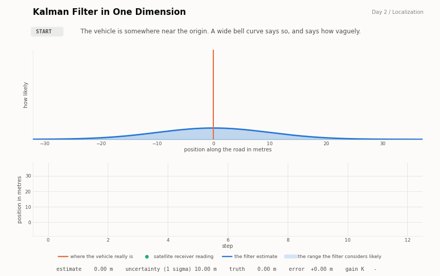
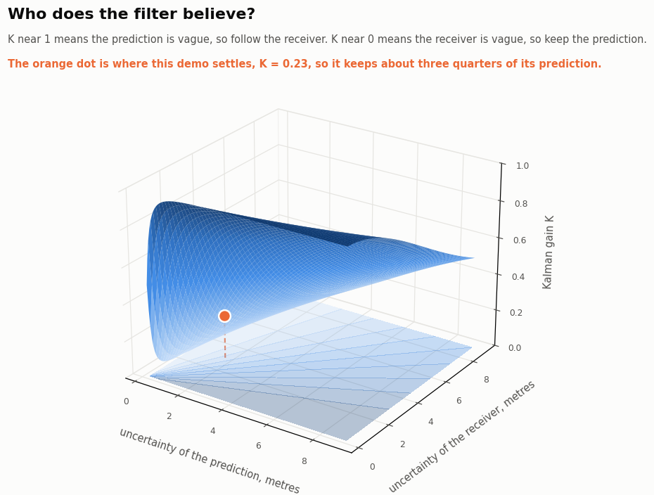
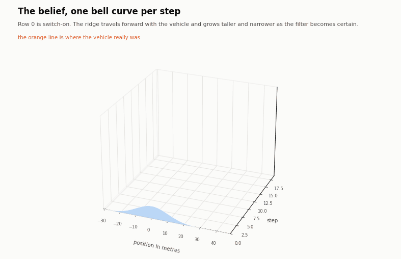
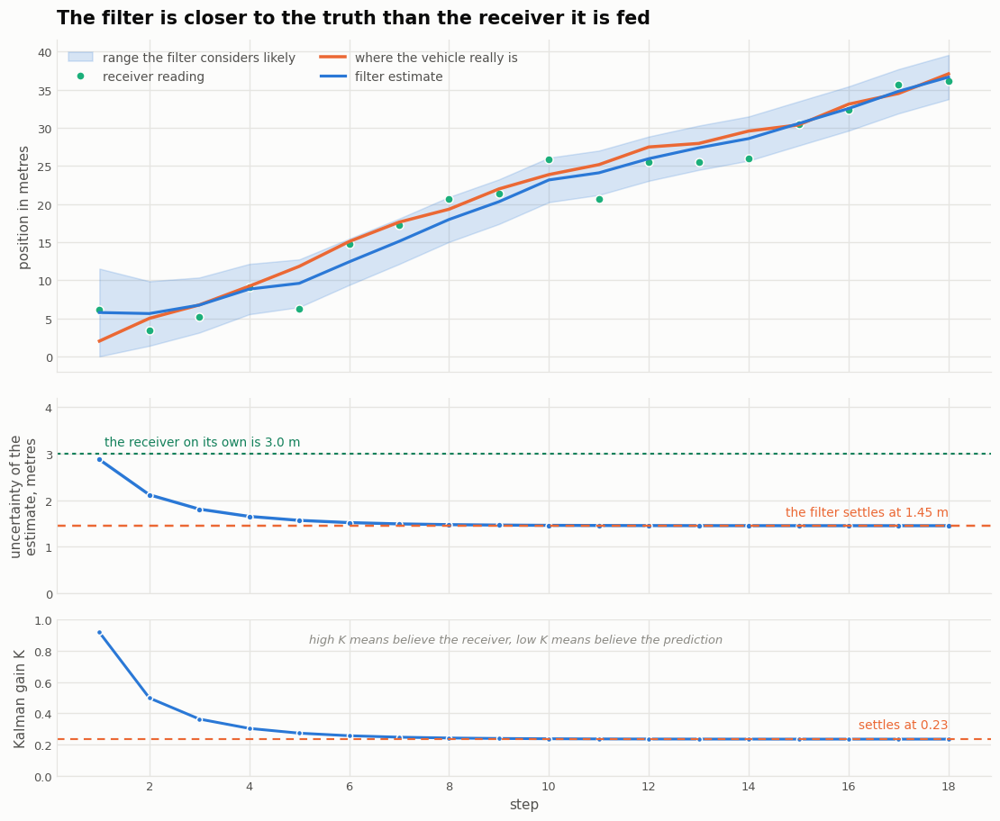
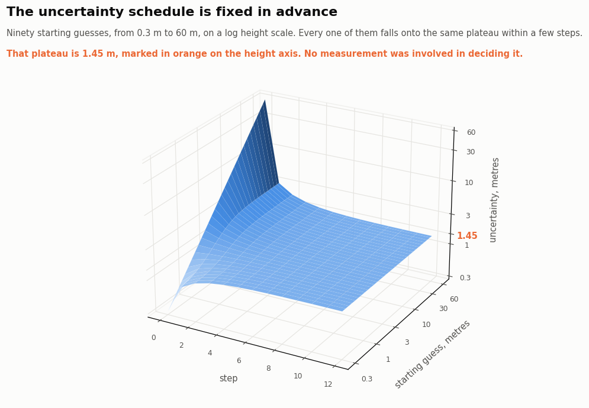

# 2 The Kalman Filter in One Dimension

## 2.1 Introduction

Day 1 ended with a complaint about cost. The histogram filter stored one number for every
cell of the world, which was acceptable for a corridor of twenty cells and hopeless for
anything larger. A robot whose state is a position and an orientation would need millions
of numbers, updated many times a second.

The Kalman filter answers that complaint in the most aggressive way available. It stores
two numbers. Not two numbers per cell, but two numbers in total. Those two numbers are the
mean and the variance of a bell curve, and the filter assumes that the belief is always a
bell curve of that shape. Everything else follows from that one assumption.

The demonstration places a vehicle on a straight road. It is told to drive 2 metres each
second and its wheels are accurate to about 0.8 metres. A satellite receiver reports its
absolute position and is accurate to about 3 metres. The vehicle starts somewhere near the
origin, known only to within about 10 metres. Figure 2.1 shows the filter at work.



**Figure 2.1**
The upper panel is the belief drawn as a bell curve over position. The lower panel is the
same run over time. The orange line is where the vehicle really is, which the filter is
never told. Notice that on every update the resulting curve is taller and narrower than
either of the two curves that produced it.

The result is worth stating before the explanation. Fed a receiver that is wrong by 2.97
metres on average, the filter produces an estimate that is wrong by 1.45 metres on average.
It is twice as accurate as its own sensor, and no extra hardware was involved.

## 2.2 Why a bell curve

A bell curve is an odd thing to insist on until the alternative is considered. Day 1 stored
the belief as a list, which could take any shape at all. The price was the length of the
list.

A bell curve is a compression. It says that the belief has one peak, that it is symmetric
about that peak, and that it falls away at a rate fixed by a single width parameter. Given
those three promises, the entire distribution is recovered from two numbers. The mean says
where the robot probably is. The variance says how vague that claim is.

The assumption is not arbitrary. When many small independent errors add together, the
result tends toward a bell curve whatever the individual errors looked like, which is the
central limit theorem. Wheel slip, gear backlash, tyre compression, and surface texture are
exactly such a collection, so the shape is often close to right in practice.

Two properties make the bell curve the only convenient choice rather than merely a
plausible one. Adding two bell curves gives a bell curve. Multiplying two bell curves gives
a bell curve. Since the two steps of a Bayes filter are precisely an addition and a
multiplication, the belief that starts as a bell curve stays one forever, and the filter
never has to represent anything it cannot store.

## 2.3 The two steps, as arithmetic on Gaussians

The alternation of day 1 is unchanged. Motion blurs the belief and observation sharpens it.
What changes is that each operation is now a single line of arithmetic instead of a loop
over cells.

### 2.3.1 The predict step is an addition

The vehicle is commanded to travel a distance u. The command is not obeyed exactly, and the
error in it has a variance q. Adding that motion to the belief adds both the means and the
variances.

```
mu    =  mu + u                                                               (2.1)
sigma^2  =  sigma^2 + q
```

The means adding is unsurprising. The variances adding is the important half. There is no
way to add two positive variances and obtain a smaller one, so a prediction can only ever
make the robot less certain. This is the same statement as the blurring of day 1, reduced
to one addition.

### 2.3.2 The update step is a multiplication

A measurement z arrives, itself uncertain, with variance r. Bayes rule says to multiply the
belief by the likelihood of the measurement. Written in terms of precision, which is one
divided by variance, the result is unusually tidy.

```
precision      =  1/sigma^2  +  1/r                                           (2.2)
mu             =  ( mu/sigma^2  +  z/r )  /  precision
sigma^2        =  1 / precision
```

Precisions add. The new mean is the average of the two old means, each weighted by how
confident it was. The consequence worth dwelling on is in the first line. Both precisions
are positive, so the new precision is larger than either input, which means the new
variance is smaller than either input.

That is a strong claim, so it is worth being explicit about what it means. Combine a
prediction that is vague with a measurement that is also vague, and the answer is sharper
than both of them. Two poor opinions genuinely do make a better one, provided their errors
are independent. This is the entire reason sensor fusion is worth doing, and Figure 2.1
shows it happening on every single update.

## 2.4 The Kalman gain

In practice the update is written a third way, which is algebraically identical to equation
2.2 but exposes the quantity engineers actually watch.

```
K   =  sigma^2 / (sigma^2 + r)                                                (2.3)
mu  =  mu  +  K (z - mu)
sigma^2  =  (1 - K) sigma^2
```

K is the Kalman gain and it always lies between 0 and 1. The quantity in brackets is the
innovation, which is the amount by which the measurement surprised the filter. The gain
decides what fraction of that surprise to act on.

The behaviour at the two extremes explains the name. When K is near 0 the filter ignores
the measurement and keeps its prediction, which is what it should do when the receiver is
far vaguer than the prediction. When K is near 1 the filter throws the prediction away and
adopts the measurement, which is what it should do when the prediction has become
worthless. K is a trust dial, and the filter sets it automatically from the two variances
rather than from anything a designer chooses. Figure 2.2 shows the whole dial at once.



**Figure 2.2**
The gain as a function of both uncertainties. Toward the back, where the prediction is
vague and the receiver is sharp, the gain approaches 1 and the filter follows the receiver.
Toward the front left, where the prediction is sharp and the receiver is vague, the gain
approaches 0 and the filter holds its ground. The orange marker is where this
demonstration settles, at a gain of 0.23.

## 2.5 A worked example

Suppose the filter believes the vehicle is at 10 metres, give or take 2 metres, so the
variance is 4. A measurement arrives saying 13 metres, give or take 3 metres, so its
variance is 9.

The gain is 4 divided by 13, which is 0.3077. The innovation is 3 metres. The filter
therefore moves 0.3077 of 3 metres, which is 0.92 metres, and lands on 10.92 metres. The
new variance is 0.6923 times 4, which is 2.77, so the new standard deviation is 1.66
metres.

Both inputs were vaguer than the answer. The prediction was good to 2 metres and the
measurement to 3 metres, and the combination is good to 1.66 metres. The following command
reproduces this, and checks that the gain form and the product form agree.

```bash
python -c "
from kalman_filter_1d import Gaussian, update
a, b = Gaussian(10.0, 4.0), Gaussian(13.0, 9.0)
post, K = update(a, b)
print(post, 'gain', round(K, 4))
print('product form gives', a * b)
"
```

## 2.6 Implementation

The algorithm lives in [kalman_filter_1d.py](kalman_filter_1d.py). Because addition and
multiplication of Gaussians are the two steps, the `Gaussian` class overloads `+` and `*`,
and the code then reads the way section 2.3 reads.

```python
def __add__(self, other):          # the predict step
    return Gaussian(self.mean + other.mean, self.var + other.var)

def __mul__(self, other):          # the update step
    var = 1.0 / (1.0 / self.var + 1.0 / other.var)
    mean = var * (self.mean / self.var + other.mean / other.var)
    return Gaussian(mean, var)
```

Unlike day 1, which used NumPy alone on purpose, this chapter uses libraries where they
help. SciPy supplies the bell curve itself through `scipy.stats.norm`, which saves writing
out the exponential and is better tested than anything written here would be.

### 2.6.1 Checking against a reference implementation

The more valuable use of a library is as a judge rather than as a tool. `filterpy` is the
standard Python implementation of the Kalman family, written by Roger Labbe. The
demonstration runs the identical measurements through both the code above and a filterpy
`KalmanFilter`, then compares the mean and the variance at every single step.

```
largest disagreement with filterpy over the whole run   1.776e-15
```

That is machine rounding error, not agreement to a few decimal places. Writing an algorithm
from scratch is how it is understood, and checking it against an established
implementation is how the understanding is shown to be correct. Both are worth doing, and
the second takes four lines.

## 2.7 Behaviour of the demonstration

Figure 2.3 draws the belief at every step as a curve in three dimensions, which is the
direct successor to the heat map of day 1.



**Figure 2.3**
One bell curve per step. Row 0 is the belief at switch-on, a wide low mound covering thirty
metres of road. The ridge then travels forward with the vehicle while growing taller and
narrower, which is what becoming certain looks like. The orange line along the floor is the
true position.

Figure 2.4 gives the same run as numbers over time.



**Figure 2.4**
The upper panel shows the estimate staying closer to the truth than the scattered receiver
readings it is built from. The middle panel shows the uncertainty falling and then
stopping. The lower panel shows the gain doing the same.

The first step is the most instructive. The filter begins barely knowing where it is, with
a standard deviation of 10 metres, while the receiver is good to 3 metres. The gain
therefore comes out at 0.918, meaning the filter discards almost all of its own prediction
and believes the receiver instead. That is the correct thing to do when the prediction is
worthless, and no one had to tell the filter so.

By step 8 the situation has reversed. The filter is now good to 1.45 metres and the
receiver is still good to only 3 metres, so the gain has fallen to 0.24. The filter now
keeps three quarters of its own prediction and uses each reading only as a gentle
correction. It has, in effect, learned that it knows better than its own sensor, purely by
tracking how its uncertainty compares with the sensor specification.

## 2.8 The uncertainty is decided in advance

There is one property of the Kalman filter that surprises almost everyone the first time
they meet it. Look again at the middle panel of Figure 2.4. The uncertainty falls and then
settles at 1.45 metres and stays there.

That settling value can be calculated before the vehicle is switched on. Once the growth
from predicting and the shrinkage from updating balance exactly, the variance stops
changing, so it satisfies

```
P  =  (P + q) r / (P + q + r)                                                 (2.4)
```

which rearranges to the quadratic P squared plus P q minus q r equals zero. With a wheel
accuracy of 0.8 metres and a receiver accuracy of 3 metres, the positive root gives a
settled standard deviation of 1.4496 metres. The demonstration reaches 1.4497 metres by
step 18.

Notice what is missing from that calculation. No measurement appears in it. The sequence of
uncertainties, and the sequence of gains along with it, depends only on the two noise
figures. It could be computed years in advance and stored in a table, and the readings the
receiver eventually produces would not change it by anything. Measurements move the
estimate. They have no influence whatever on the confidence in that estimate.



**Figure 2.5**
Ninety different starting guesses, spanning a factor of two hundred from 0.3 metres to 60
metres, plotted on a logarithmic height scale. Every one of them lands on the same plateau
within a handful of steps. A wildly optimistic start and a wildly pessimistic start are
indistinguishable after six steps.

This is why a Kalman filter can be engineered rather than tuned by trial. The accuracy it
will deliver is a property of the sensors, and it is known before any of them are switched
on.

## 2.9 Running the code

```bash
cd Localization/day02_kalman_filter_1d
pip install -r ../../requirements.txt
python run_demo.py              # prints the trace and writes all five figures
python run_demo.py --no-gif     # skips the two animations, runs in a few seconds
```

An extract of the output follows.

```
step        event      estimate   sigma     truth     error     K
  0    switched on       0.00   10.00      0.00    +0.00      -
  1       predict        2.00   10.03      2.03    -0.03      -
  1       update         5.77    2.87      2.03    +3.74  0.918
  2       predict        7.77    2.98      5.01    +2.76      -
  2       update         5.63    2.12      5.01    +0.63  0.497
  3       update         6.75    1.81      6.77    -0.02  0.362
  ...
 17       update        34.78    1.45     34.49    +0.29  0.234
 18       predict       36.78    1.66     37.07    -0.29      -
 18       update        36.64    1.45     37.07    -0.43  0.234

largest disagreement with filterpy over the whole run  1.776e-15
predicted steady state sigma  1.4496 m      gain 0.2335
reached by step 18         1.4497 m      gain 0.2335

over 400 runs   receiver alone 2.970 m RMS   filtered 1.454 m RMS   improvement 2.04x
```

Every predict line raises sigma and every update line lowers it, which is the alternation
of day 1 in a different notation.

## 2.10 Exercises

1. Set `SIGMA_SENSOR = 12.0`, making the receiver much worse than the wheels. The gain
   collapses toward 0 and the filter almost ignores the receiver, coasting on its own
   prediction. Confirm with `steady_state_gain` that the settled gain is what you observe.

2. Set `SIGMA_PROCESS = 0.01`, making the wheels nearly perfect. The settled uncertainty
   drops far below the receiver accuracy, because a filter that trusts its own motion can
   average many readings together. This is how a good inertial unit improves a poor
   satellite fix.

3. Start the filter with a deliberate lie. Set the initial mean to 500 metres while leaving
   `SIGMA_INITIAL` at 10, which claims great confidence in a badly wrong position. The
   filter takes many steps to recover, because a small variance makes a small gain and a
   small gain refuses to listen. An overconfident filter is more dangerous than an
   uncertain one.

4. Delete the predict step and feed the filter measurements alone. The estimate becomes a
   running average and lags further behind the more the vehicle moves, because the filter
   no longer knows that the vehicle is travelling.

5. Make the errors non Gaussian. Replace the receiver noise with an occasional large
   outlier, for example by adding 40 metres to one reading in twenty. The filter has no
   defence, because equation 2.2 has no way to express the idea that a reading might simply
   be wrong. Day 1 handled a false reading gracefully and this chapter cannot. Section 2.11
   explains why.

## 2.11 Limitations and what follows

The compression that makes the Kalman filter fast is also the whole of what is wrong with
it. A bell curve has one peak, so the filter can only ever hold one hypothesis.

Consider the aliased corridor from exercise 3 of day 1, where four positions were exactly
equally plausible. A histogram filter held four peaks and waited for evidence to separate
them. A Kalman filter cannot. Asked to represent the belief that the vehicle is either at
10 metres or at 60 metres, it reports a mean of 35 metres with a large variance, which
names the one location the vehicle is known not to occupy, and reports it with apparent
confidence.

The same weakness explains exercise 5. A single wild measurement cannot be treated as
probably spurious, because a bell curve assigns a smooth and rapidly shrinking probability
to distant values and has no vocabulary for the idea of a reading that should be ignored.
Table 2.1 sets the two chapters side by side.

**Table 2.1**
What the second day bought and what it cost

| Property | Histogram filter, day 1 | Kalman filter, day 2 |
|---|---|---|
| Size of the belief | one number per cell, twenty here | two numbers, always |
| Cost of an update | proportional to the number of cells | fixed, a handful of arithmetic |
| Shapes it can represent | any shape at all | one symmetric peak |
| Several competing hypotheses | held simultaneously | impossible |
| Recovery from a false reading | automatic, shown on day 1 | poor |
| Accuracy known before switch-on | no | yes, section 2.8 |

Day 3 keeps the single peak and removes the restriction to one dimension, so that the mean
becomes a vector and the variance becomes a covariance matrix. That change also brings the
most useful property of the whole family, which is the ability to estimate a quantity that
is never measured at all, such as velocity inferred from a sequence of positions.

The single peak restriction is not lifted until the particle filter on day 6.

## 2.12 Notes on the demonstration

The random seed is 11 and the wheel and receiver errors are drawn fresh on every run of the
simulation, so changing the seed changes the path and the readings but not the sequence of
uncertainties, for the reason given in section 2.8.

The accuracy comparison in section 2.1 is measured over 400 independent runs, discarding
the first 8 steps of each so that the initial uncertainty does not flatter the receiver.

The animation in Figure 2.1 stops at step 12 because the filter has fully settled by step 8
and the remaining steps add length without adding anything to look at. Figures 2.3 and 2.4
show all 18 steps.

The figures use the same three colours as day 1, where blue is the belief, orange is the
truth that the filter is never shown, and green is the sensor.
