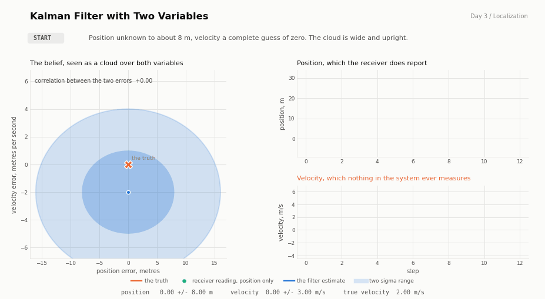
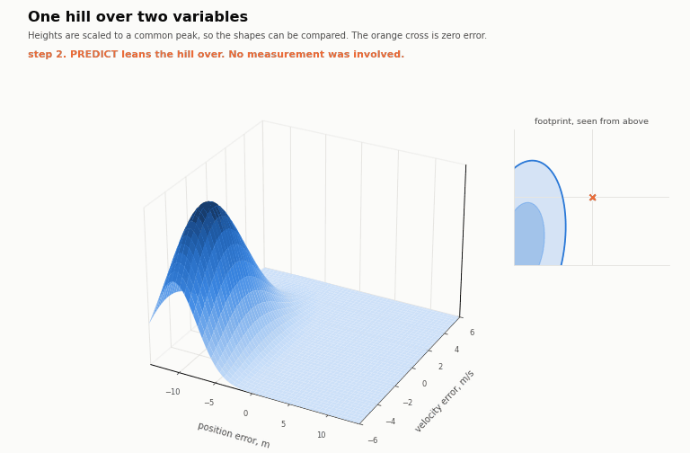
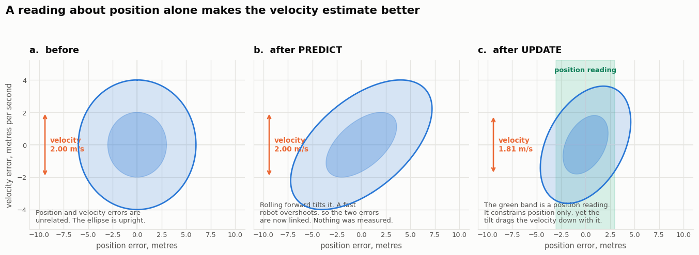
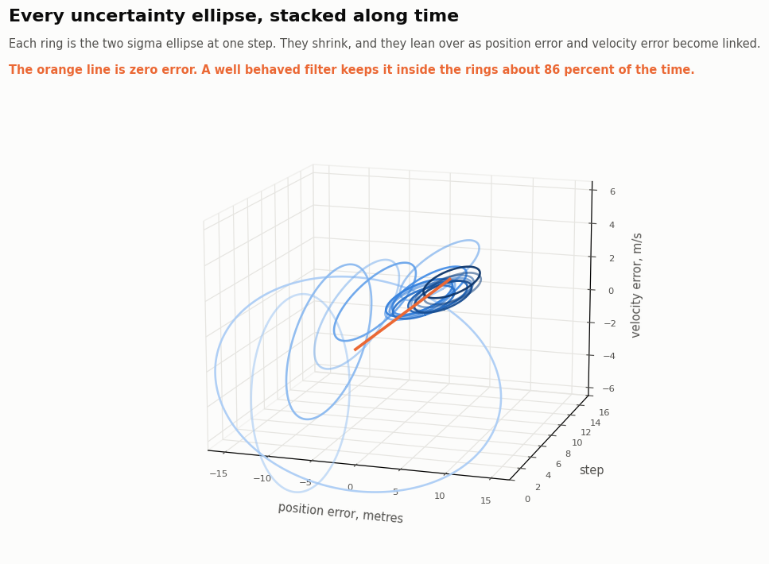
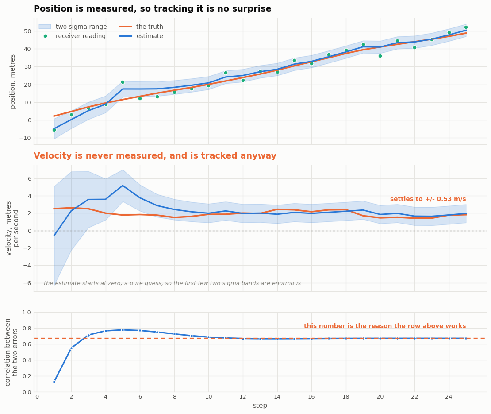

# 3 The Kalman Filter with Several Variables

## 3.1 Introduction

A vehicle drives along a straight road. A satellite receiver reports its position and
nothing else. There is no speedometer anywhere in the system, no wheel encoder, and no
radar. The question asked of the filter is how fast the vehicle is going.

That question has an answer, and the answer is good to about half a metre per second. This
chapter is about how a quantity that is never measured comes to be known almost as well as
one that is.

Day 2 stored the belief as a mean and a variance, two numbers describing a bell curve on a
line. Here the mean becomes a vector and the variance becomes a covariance matrix. The
belief becomes a hill over a plane rather than a curve over a line. The two steps of the
filter are the same two steps, written with matrices instead of scalars.

The state carries both quantities at once.

```
x  =  [ position ]          P  =  [ var(p)      cov(p,v) ]
      [ velocity ]                [ cov(p,v)    var(v)   ]
```

The demonstration uses a receiver accurate to 3 metres, the same as day 2, and a vehicle
whose speed drifts by about 0.25 metres per second each second. The filter is started with
no idea of the position, to within 8 metres, and no idea of the speed at all, its initial
guess being exactly zero. Figure 3.1 shows what happens.



**Figure 3.1**
On the left the belief is drawn as a cloud over both variables, with the true state at the
origin. On the right are the two variables against time. The lower right panel has no
green dots on it, because velocity is never measured. It is tracked anyway.

## 3.2 What a covariance matrix adds

The diagonal entries of P are the familiar ones. They are the variance of the position and
the variance of the velocity, each taken on its own, and they are what day 2 already had.

The off diagonal entry is new, and it is the whole subject of this chapter. It records how
the two errors are related. A value of zero means that being wrong about the position says
nothing at all about the velocity. A large positive value means that whenever the filter
has overestimated the position it has very probably overestimated the velocity too.

Drawn as a picture, the covariance is an ellipse, and the off diagonal entry is its tilt.
An upright ellipse means no relationship. A leaning ellipse means a strong one. Figure 3.2
shows the belief as a hill over the two variables, which is the direct successor to the
bell curve of day 2.



**Figure 3.2**
The same belief as figure 3.1, drawn as a surface. The inset shows the footprint from
directly above, which is the uncertainty ellipse. Watch the hill lean over on every
predict and pull inward on every update. The heights are scaled to a common peak so the
shapes can be compared, because the true peak height rises by a factor of thirty five over
the run and the early hills would otherwise be invisible.

One detail is worth stating because it is quietly got wrong very often. A two sigma
interval in one dimension holds 95.4 percent of the probability. A two sigma ellipse in
two dimensions holds only 86.5 percent, because probability can escape in more directions.
The function `ellipse_coverage` in the algorithm file returns the honest figure for any
number of dimensions.

## 3.3 The two steps, written with matrices

Table 3.1 names the pieces. Nothing here is new in spirit. Every entry has a scalar
ancestor in day 2.

**Table 3.1**
The matrices and what each one is for

| Symbol | Name | What it does | Day 2 ancestor |
|---|---|---|---|
| x | state | the best estimate, now a vector | the mean |
| P | covariance | the uncertainty, and how the errors are linked | the variance |
| F | state transition | how the state moves on its own in one step | adding u |
| Q | process noise | how much the motion model is trusted | q |
| H | observation | which parts of the state the sensor sees | taking z directly |
| R | measurement noise | how much the sensor is trusted | r |
| K | Kalman gain | how far to move toward the reading, now a vector | K |

### 3.3.1 Predict

```
x  =  F x
P  =  F P F' + Q                                                              (3.1)
```

For this vehicle F says that the new position is the old position plus the velocity times
one second, and that the velocity is unchanged.

```
F  =  [ 1  dt ]
      [ 0   1 ]
```

The second line of equation 3.1 is where the interesting thing happens. Suppose P starts
perfectly diagonal, so the two errors are unrelated. The product F P F' is generally not
diagonal. Working it through by hand with dt of one second gives an off diagonal entry
equal to the variance of the velocity, which is not zero.

The predict step therefore manufactures correlation out of nothing. This is not a trick of
the algebra. It is a statement about the world. If the robot is travelling faster than the
filter believes, then after one second it will also be further along than the filter
believes. The two errors become linked because the physics links them.

### 3.3.2 Update

```
y  =  z - H x                  the innovation, how surprising the reading was
S  =  H P H' + R               how surprising a reading was expected to be
K  =  P H' inv(S)                                                             (3.2)
x  =  x + K y
P  =  (I - K H) P
```

H selects what the sensor can see. A receiver that reports position and nothing else has
one row.

```
H  =  [ 1  0 ]
```

## 3.4 Measuring one thing and learning another

Now the two halves can be put together, and the result is the point of the chapter.

Write out K from equation 3.2 for this particular H. The product P H' picks out the first
column of P, which is the position variance on top and the position and velocity
covariance underneath. S is a single number. So the gain is

```
K  =  [ var(p)   / (var(p) + r) ]        the position correction
      [ cov(p,v) / (var(p) + r) ]        the velocity correction               (3.3)
```

The lower entry is the one to look at. It says how much the velocity estimate moves for
every metre of surprise in the position reading, and it is proportional to `cov(p,v)`.

If the correlation were zero, that entry would be zero, and no position reading would ever
change the velocity estimate by anything. The filter would be blind to speed forever. It is
the correlation created by the predict step that makes the entry non zero, and so the two
steps hand work to each other. Predict manufactures the correlation. Update spends it.

In this demonstration the settled gain is

```
K  =  [ 0.3347 ]      each metre of surprise moves the position by 33 cm
      [ 0.0680 ]      and the velocity by 6.8 cm per second
```

Figure 3.3 shows the whole argument in three pictures.



**Figure 3.3**
Panel a is a belief with no correlation, drawn as an upright ellipse, with the velocity
uncertain to 2.00 metres per second. Panel b is the same belief after one predict step. It
has leaned over, and the velocity uncertainty is unchanged at 2.00, because predicting
never improves anything. Panel c applies a position reading, the green band, which
constrains the horizontal direction only. Because the ellipse is leaning, trimming it
horizontally also trims it vertically, and the velocity uncertainty falls to 1.81 metres
per second.

That is the entire mechanism. A leaning ellipse cut by a vertical band gets shorter as well
as narrower. Had the ellipse been upright, as in panel a, the same cut would have changed
the velocity by nothing at all.

## 3.5 A worked example

The numbers in figure 3.3 can be checked by hand. Start with a position variance of 9 and a
velocity variance of 4, uncorrelated.

Predict with dt of one second. The new position variance is 9 plus 4, which is 13, and the
new off diagonal entry is 4. The correlation is 4 divided by the square root of 13 times 2,
which is 0.555. Nothing was measured and yet the two errors are now strongly linked.

Update with a position reading of variance 9. S is 13 plus 9, which is 22. The gain is 13
over 22 for the position and 4 over 22 for the velocity, which is 0.591 and 0.182. Applying
the last line of equation 3.2 leaves a velocity variance of 3.27, down from 4.

```bash
python -c "
import numpy as np
from kalman_filter_nd import GaussianState, predict, update
F = np.array([[1.,1.],[0.,1.]]); H = np.array([[1.,0.]])
s = GaussianState([0,0], np.diag([9.,4.]))
p = predict(s, F, np.zeros((2,2)))
print('after predict, correlation %+.3f' % p.correlation[0,1])
r = update(p, [0.0], H, np.array([[9.0]]))
print('velocity sigma %.3f -> %.3f m/s' % (p.std[1], r.state.std[1]))
print('gain', r.gain.ravel())
"
```

## 3.6 Implementation

The algorithm is in [kalman_filter_nd.py](kalman_filter_nd.py). Equations 3.1 and 3.2
translate almost character for character.

```python
def predict(state, F, Q):
    return GaussianState(F @ state.mean, F @ state.cov @ F.T + Q)
```

### 3.6.1 The Joseph form

The update is written in a way that does not match equation 3.2 exactly.

```python
A = np.eye(n) - K @ H
cov = A @ state.cov @ A.T + K @ R @ K.T          # Joseph form
```

This is algebraically the same as `(I - K H) P` and is more work to compute. It is used
because it behaves better in arithmetic of limited precision. A covariance matrix must stay
symmetric and must keep all its eigenvalues positive, and the short form slowly loses both
properties over thousands of updates until the filter fails outright. The Joseph form is
built as a sum of two terms that are each symmetric by construction, so the error cannot
accumulate the same way. Running the demonstration filter for 500 steps leaves an asymmetry
of exactly zero.

### 3.6.2 Checking against a reference implementation

As on day 2, the same measurements are pushed through this code and through a filterpy
`KalmanFilter`, and the state and the covariance are compared at every step.

```
largest disagreement with filterpy   8.882e-16
```

Libraries are used where they are genuinely better than writing it out. `filterpy` supplies
`Q_discrete_white_noise`, which builds Q for a constant velocity model from a single
acceleration figure, and getting that matrix right by hand is a common source of error.
SciPy supplies `multivariate_normal` for drawing the hill and `solve_discrete_are` for
section 3.8.

## 3.7 Behaviour of the demonstration



**Figure 3.4**
The two sigma ellipse at every step, threaded along time. The rings start large and
upright, then shrink and lean over as the correlation builds. The orange line is zero
error, and a filter that is honest about its own uncertainty keeps that line inside the
rings about 86 percent of the time.



**Figure 3.5**
The upper panel is position, which is measured. The middle panel is velocity, which is not.
The estimate starts at zero, which is a pure guess and wrong by two metres per second,
overshoots to above five, and then settles onto the truth with a band that narrows to plus
or minus half a metre per second. The lower panel is the correlation, which climbs from
zero to about 0.78 and then settles at 0.67.

The middle and lower panels should be read together. The velocity estimate becomes useful
at exactly the pace that the correlation grows, because by equation 3.3 the correlation is
the channel through which position readings reach the velocity at all.

Measured over 400 independent runs, discarding the first twelve steps of each,

| Quantity | Result |
|---|---|
| Receiver position error | 2.972 m RMS |
| Filtered position error | 1.730 m RMS, 1.72 times better |
| Velocity error | 0.518 m per second RMS, from no speed sensor of any kind |

## 3.8 The steady state, in closed form

Day 2 found the settled variance by solving a quadratic. The same balance point exists here
and it is the solution of a matrix equation called the discrete algebraic Riccati equation.

```
P  =  F P F' - F P H' inv(H P H' + R) H P F' + Q                              (3.4)
```

Nobody solves that by hand and nobody needs to, because SciPy solves it directly.

```python
from scipy.linalg import solve_discrete_are
P_prior = solve_discrete_are(F.T, H.T, Q, R)
```

The demonstration prints the closed form answer beside the value the filter actually
reaches.

| Quantity | Closed form | Reached by step 25 |
|---|---|---|
| Position uncertainty | 1.7356 m | 1.7358 m |
| Velocity uncertainty | 0.5259 m per second | 0.5259 m per second |
| Correlation | +0.6702 | +0.6703 |

As on day 2, no measurement appears anywhere in equation 3.4. How well this system will
estimate a speed it cannot measure is decided by the geometry of F, H, Q and R alone, and
could be worked out before the vehicle was built.

## 3.9 Running the code

```bash
cd Localization/day03_kalman_filter_nd
pip install -r ../../requirements.txt
python run_demo.py              # prints the trace and writes all five figures
python run_demo.py --no-gif     # skips the two animations
```

An extract of the output follows.

```
step     event    est pos   sigma    est vel   sigma   true vel   corr
  0    start        0.00    8.00     0.00    3.00     2.00   +0.000
  1    predict      0.00    8.54     0.00    3.01     2.51   +0.351
  1    update      -4.82    2.83    -0.60    2.84     2.51   +0.123
  2    predict     -5.41    4.25    -0.60    2.85     2.61   +0.750
  2    update       0.28    2.45     2.27    2.25     2.61   +0.547
  3    update       5.29    2.43     3.57    1.62     2.50   +0.713
  4    update       8.90    2.34     3.58    1.18     2.00   +0.765
  8    update      18.37    1.94     2.42    0.59     1.50   +0.726
 12    update      25.01    1.77     1.97    0.53     2.00   +0.668
 24    update      47.79    1.74     1.79    0.53     1.77   +0.670
```

Follow the velocity column. It begins at a guess of zero, overshoots, and arrives. Follow
the correlation column alongside it and the reason is visible.

## 3.10 Exercises

1. Break the coupling. Set `F = np.array([[1.0, 0.0], [0.0, 1.0]])`, which claims that
   position does not depend on velocity. The velocity estimate still moves, which is worth
   pausing over before reading on. The reason is that `Q_discrete_white_noise` does not
   return a diagonal matrix. A random push on the accelerator changes position and velocity
   together, so the process noise carries a correlation of its own, 0.0312 in this case,
   and that alone is enough to keep the channel open. Now also replace Q with
   `np.diag([0.0156, 0.0625])`, which has the same diagonal and no coupling. The
   correlation is then exactly zero at every step, the lower entry of the gain in equation
   3.3 is exactly zero, and after thirty steps the velocity estimate reads 0.000000, having
   never moved. Those two runs together isolate the coupling as the thing doing the work.

2. Measure the velocity instead. Set `H = np.array([[0.0, 1.0]])` and feed noisy speed
   readings, expecting position to be recovered the way velocity was. Something worse than
   poor accuracy happens. The velocity settles at 0.85 metres per second as expected, but
   the position uncertainty grows without limit, reaching 31 metres after 100 steps, 95
   metres after 1000 and 300 metres after 10000, roughly as the square root of the number
   of steps. Position is unobservable from speed alone, because shifting the entire
   trajectory by a constant produces exactly the same speed readings forever, so no amount
   of data can distinguish the two. Calling `steady_state` on this pair raises
   `LinAlgError` from SciPy, which is the library reporting that equation 3.4 has no finite
   solution. The formal test is the rank of the observability matrix, which is 2 for a
   position sensor and 1 for a velocity sensor. Note how badly the symmetry fails.
   Differentiating a measured position to recover velocity works. Integrating a measured
   velocity to recover position does not.

3. Add a second sensor, and work out whether it is worth having. Make H two rows so that
   position and velocity are both measured, and set `R = np.diag([9.0, sigma_v**2])`. A
   speed sensor good to 4 metres per second moves the settled velocity uncertainty from
   0.526 to 0.516, a gain of 2 percent, which would not justify the wiring. At 1 metre per
   second it reaches 0.420, and at 0.3 metres per second it reaches 0.223. The crossover is
   the 0.53 that the filter already achieves unaided. A sensor is worth adding only when it
   is better than what the rest of the system already infers for nothing, and `steady_state`
   answers that question before anything is bought rather than after.

4. Make the vehicle turn. Give the true vehicle a sudden change in speed partway through,
   for example by adding 6 metres per second at step 15. The filter lags behind, because a
   constant velocity model says such a thing does not happen. The size of Q controls how
   long the lag lasts, which is the main tuning decision in practice.

5. Add acceleration as a third variable, making the state three long with F the constant
   acceleration model. Averaged over 60 runs containing the manoeuvre of exercise 4, the
   position error during the manoeuvre falls from 4.33 metres to 2.18 metres, which is a
   large win. During the steady stretches it rises from 2.21 metres to 2.29 metres, which
   is a small loss. A model with more freedom follows real change better and follows noise
   better too, and choosing between them is a judgement about how often the vehicle
   actually manoeuvres.

## 3.11 Limitations and what follows

Nothing in this chapter relaxed the restriction that ended day 2. The belief is still one
hill with one peak, and a robot that might be in either of two identical lift lobbies still
cannot be described.

What has changed is the reach of the method. Table 3.2 sets the three days side by side.

**Table 3.2**
The three chapters so far

| | Day 1, histogram | Day 2, Kalman in 1D | Day 3, Kalman in nD |
|---|---|---|---|
| Belief | one number per cell | a mean and a variance | a vector and a matrix |
| Variables | one | one | as many as wanted |
| Hidden variables | not possible | not possible | recovered through correlation |
| Several peaks | yes | no | no |
| Cost | grows with the world | fixed and tiny | grows with the cube of the state |

There is a second restriction that has gone unmentioned because this chapter never tested
it. Every equation here assumes F and H are matrices, which is to say the motion and the
sensor are linear. A vehicle driving in a straight line satisfies that. A vehicle that
steers does not, because a heading change mixes the coordinates through a sine and a
cosine. A range and bearing sensor does not either.

Almost every real robot violates linearity. Day 4 keeps everything in this chapter and
replaces F and H with their local linear approximations, computed fresh at every step from
the Jacobian, which gives the extended Kalman filter.

## 3.12 Notes on the demonstration

The true speed is not held constant. It is nudged by a random acceleration at every step,
which is what Q describes, and over 25 steps it wanders between about 1.5 and 2.6 metres
per second. The filter is therefore tracking a moving target rather than converging onto a
fixed number, which is the more honest test.

The phase space panel of figure 3.1 and the whole of figures 3.2 and 3.4 are drawn in error
coordinates, which is to say the true state is placed at the origin and the belief is drawn
relative to it. In absolute coordinates the cloud would travel fifty metres across the
frame while shrinking to a dot, and nothing about its shape would be visible.

The animation in figure 3.1 stops at step 12 and figure 3.2 covers steps 2 to 8, because
the interesting changes are over by then. Figures 3.4 and 3.5 show the full run.

Colours are unchanged from day 1, where blue is the belief, orange is the truth that the
filter is never shown, and green is the sensor.
